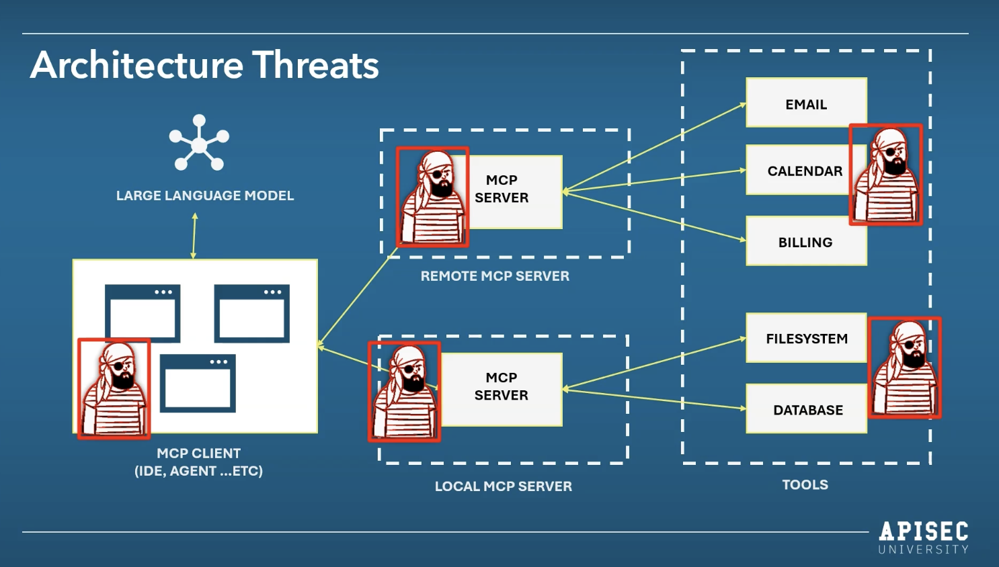

> **Docs:** [mcp security fundamentals](https://www.apisecuniversity.com/courses/mcp-security-fundamentals)

> *la estandarización de un MCP es el USB-C de nuestra epoca*

## ¿Que es MCP?
Model Context Protocol
En etapas iniciales de los LLMs, sucedia que, estos modelos respondian a preguntas directas pero no tenian la capacidad de conectarse con servicios o tener memoria de 2  3 preguntas que se hbian realizado anteriormente, **en resumidas cuentas antes los LLMs se encontraban aislados de todo ecosistema tecnologico**.
### El USB C de la IA
Cuando se diseñó MCP se pensó justamente en estandarizar las comunicaciociones de los modelos con cualquier otro servicio tecnologico. haciendo un simil a la tecnologica de USB tipo C en la cual todos los dispositivos de la acutalidad se encuentran. Lo que se ganó al generar MCP fue mayor capacidad de memoria y contexto en las preguntas, adicionalmente se logró integrar por medio de APIs enfocadas a los LLMs para poder integrarse de manera nativa y ejecutar acciones de manera inmediata. **Un cliente MCP podria ser perfectamente CLAUDE y las herramientas del MCP podrian ser conexiones a GMAIL, Dropbox, etc.**

## Las 5 capas de una arquitecturas MCPs
### 1. Host Application Layer
  - **¿Que es?** Corresponde a la aplicación anfitriona desde la cual interactúa el usuario, como por ejemplo Claude Desktop, Cursor, ChatGPT o Windsurf. En esta capa, el usuario ingresa su solicitud y el modelo de lenguaje (LLM) la procesa para comprender la intención. Si determina que necesita una herramienta externa para completar la petición, inicia el flujo hacia las capas siguientes.
  - **¿Que podria salir mal?**
    - Prompt Injection
    - Fatiga de permisos

### 2. MCP Client Layer
  - **¿Que es?** Es la capa cliente de MCP y se encarga de gestionar la comunicación entre la aplicación anfitriona y el servidor MCP. Aquí se encuentran las descripciones de las herramientas disponibles, las cuales sirven para que el modelo entienda qué capacidades puede utilizar. Esta capa prepara y envía la solicitud a través del mecanismo de comunicación definido, como STDIO o protocolos basados en HTTP/HTTPS.
  - **¿Que podria salir mal?**
    - Robo de tokens
    - ByPass de autenticación

### 3. Transport Layer
  - **¿Que es?** Es la capa de transporte y su función es mover la información entre el cliente MCP y el servidor MCP. Define el canal por el cual viajan las solicitudes y respuestas. Dependiendo de la implementación, esta comunicación puede realizarse por STDIO, cuando se trabaja con procesos locales, o por HTTP/HTTPS, cuando la interacción ocurre a través de red.
  - **¿Que podria salir mal?**
    - Inyección de comandos
    - Man in the Midlle

### 4. MCP Server Layer
  - **¿Que es?** Es la capa servidora de MCP y actúa como intermediaria entre el modelo de IA y las herramientas o servicios disponibles. Recibe la solicitud del cliente, interpreta qué herramienta debe ejecutarse y coordina la invocación correspondiente. En otras palabras, esta capa funciona como el puente lógico entre la IA y los proveedores de herramientas.
  - **¿Que podria salir mal?**
    - RCE
    - SQLi
    - Path Traversal

### 5. External Resource Layer
  - **¿Que es?** Corresponde a la capa de recursos externos. Aquí se encuentran las herramientas, servicios, APIs, bases de datos o sistemas que finalmente ejecutan la acción solicitada. Esta capa recibe la petición del servidor MCP, realiza la operación requerida y devuelve el resultado para que sea entregado nuevamente al modelo y, posteriormente, al usuario.
  - **¿Que podria salir mal?**
    - Cadena de suministros
    - Hijacking
   
## Limites de cofianza de una aplicacion tradicional vs un MCP

| App      | MCP              |
|----------|------------------|
| User     | User             |
| App      | IA               |
| Database | MCP Client       |
| N/A      | MCP Server       |
| N/A      | External systems |

## Arquitectura de amenazas MCP

